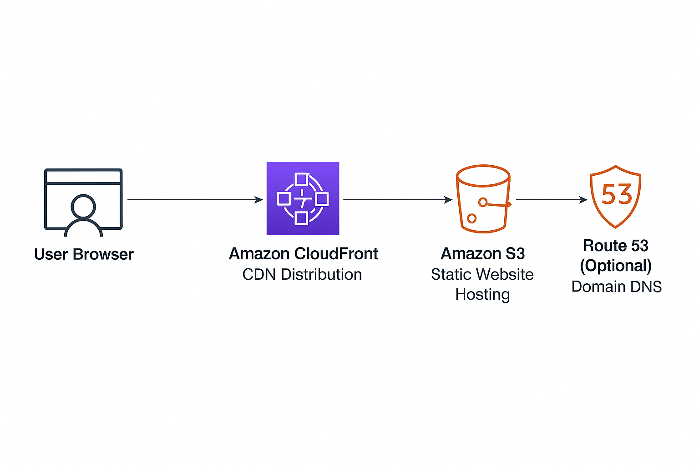

# AWS Cloud Lab

A hands-on project designed to demonstrate knowledge and practical experience with AWS cloud infrastructure by deploying a static website using Amazon S3, with optional automation and CDN configurations.

---

## 🌐 Project Overview

This lab simulates a real-world cloud deployment pipeline for a static website, focusing on core AWS services. The goal is to showcase technical proficiency with AWS through a simple, secure, and scalable site setup.

Although the site is not live, all the structure, code, and deployment instructions are fully documented and ready to be executed.

---

## 🧰 Technologies Used

- **HTML5 & CSS3** – Frontend layout and styling
- **Amazon S3** – Static website hosting
- **AWS IAM** – Secure access configuration
- **Amazon CloudFront** – Global content delivery via CDN (optional)
- **Amazon Route 53** – Domain management and DNS (optional)
- **AWS CLI & Terraform** – Infrastructure as Code and automation (optional)

---

## ☁️ AWS Services Architecture



---

## 🚀 Deployment Steps (manual via AWS Console)

1. Create an S3 bucket with "Static website hosting" enabled.
2. Upload the `index.html` and `style.css` files.
3. Set correct permissions (Bucket Policy) to allow public read access.
4. (Optional) Attach a custom domain via Route 53.
5. (Optional) Distribute content through CloudFront.

---

## ⚙️ Deployment via AWS CLI (optional)

```bash
aws s3 mb s3://aws-cloud-lab-website
aws s3 sync ./site s3://aws-cloud-lab-website --acl public-read
aws s3 website s3://aws-cloud-lab-website/ --index-document index.html

## 🛠 Deployment Options

### 🔸 AWS CLI (manual script)

To deploy the static site manually via AWS CLI:

```bash
chmod +x deploy.sh
./deploy.sh

## ⚙️ Terraform Deployment

To deploy via Terraform:

```bash
terraform init
terraform apply